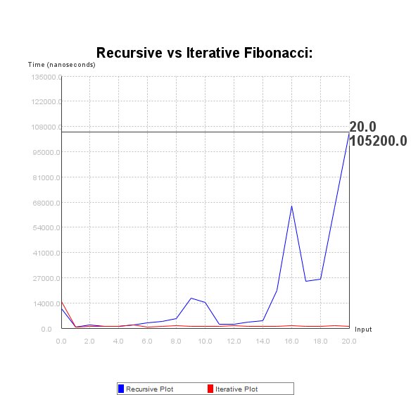
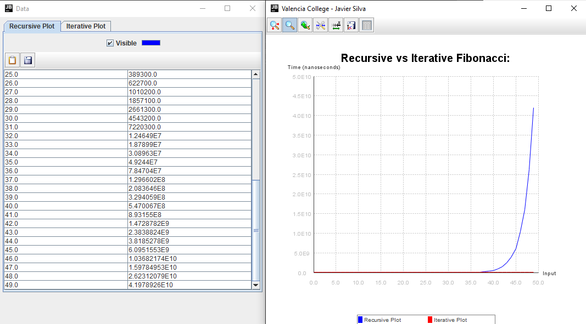

<h1> Fibonacci Sequence:</h1>
	Implement the Fibonacci function in both a recursive and iterative fashion. What’s the runtime efficiency of each?  
<li> <b>Turn in a chart of the results</b>, with time on the Y axis, and input on the X axis, Please use nanosecond. long startTime = System.nanoTime(); This chart must not be hand written.
 
<h2> Solution </h2>
 	To solve this problem, a fibonacci function got implemented via Recursion and Iteration, their execution times were measured and then compared in a plot. The <b><a href="https://github.com/yannrichet/jmathplot">JMathPlot repo</a></b> was used to create the plot.
 
<h3> Design Walkthrough </h3>
		To set up the environment, add the jars in the jar folder to your Java Classpath, these two jars are part of Yann Richet's <b><a href="https://github.com/yannrichet/jmathplot">JMathPlot repo</a></b> which is used to plot the arrays after the program is done.

Here is the Recursive Function used to calculate the fibonacci sequence and the execution time:
The recursive function, checks if the number is either 0 or 1 and returns it, otherwise, it returns the sum of the Fibonacci function of the variable - 1 plus the Fibonacci function of the variable - 2, and it continues to repeat itself until all functions return a 0 or a 1.
	
	public static long FibonacciRecursive(long n) {
		if (n == 0){ return n;}
		if (n == 1){ return n;}
			else
		return FibonacciRecursive(n - 1) + FibonacciRecursive(n - 2);
	}
<b>Esentially it does this:</b>

	</img>

<b>And its Iterative counterpart:</b>

  	public static long FibonacciIterative(long n) {
   	int PrevPrev, PrevNumber = 0, CurrNumber = 1;   
   	for (int i = 1; i < n ; i++) {
    	PrevPrev = PrevNumber;
    	PrevNumber = CurrNumber;
    	CurrNumber = PrevPrev + PrevNumber;
   		}
    	return CurrNumber;
   	}
	
When it comes to making a graph in Java, we'll use <b><a href="https://github.com/yannrichet/jmathplot">JMathPlot</a></b>, which is similar to Matplotlib in Python, and allows us to graph arrays utilizing JFrame and plots.

<b>Creating the PlotPanel:</b>

	Plot2DPanel plot = new Plot2DPanel();

<b>Defining the Legend Position and Title:</b>

	plot.addLegend("SOUTH");
	BaseLabel title = new BaseLabel("Recursive vs Iterative Fibonacci:", Color.black, 0.5, 1.1);
	title.setFont(new Font("Courier", Font.BOLD, 20));
	plot.addPlotable(title);

<b>Adding the line plots to the plot:</b>

	plot.addLinePlot("Recursive Plot", InputA, TimeA);
	plot.addLinePlot("Iterative Plot", InputB, TimeB);

<b>Finally, putting the Plot into a JFrame:</b>

	JFrame frame = new JFrame("Valencia College - Javier Silva");
	frame.setSize(600, 600);
	frame.setContentPane(plot);
	frame.setVisible(true);
	
<h3> Output and Explanation </h3>
	Here's the final graph of the execution times of the recursive function (blue) vs the iterative function (red):

	</img>

We can clearly see how in this case, the recursive function takes longer to run than the iterative one, the reason why is that no matter the number, the iterative function will always be linear and run on O(n) time. Meanwhile, the recursive function grows at an exponential rate, or O(2^n), as it has to go through the entire tree of possible values before arriving at the solution. This exponential graph can be viewed perfectly when we graph the execution time of the function as we go from 0 to 49:
	

</img>

<b>The program took almost 43 seconds to find the value of the fibonacci sequence of 49!</b>
